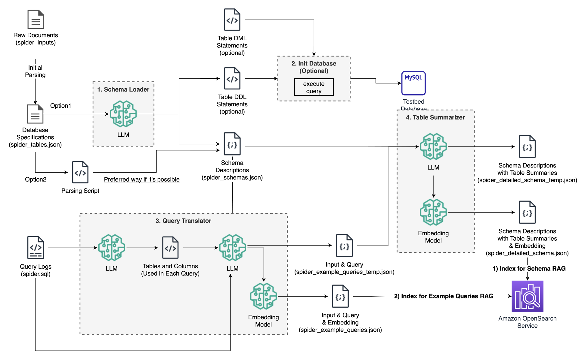

# Text-to-SQL Bedrock

This repository contains multiple labs focused on implementing Text-to-SQL using various tools and techniques. Below are the details for each lab included in this repository.

## Lab 1: Text-to-SQL Implementation (Prompt Engineering & RAG & Tool Use)

This lab focuses on implementing Text-to-SQL functionality with different approaches.

- `lab1_text2sql_implementation/`
  - `1.basic_implementation.ipynb`: Jupyter notebook for text-to-sql prompt engineering.
  - `2.function_calling(tool_use).ipynb`: Jupyter notebook for text-to-sql workflow design using Tool Use.

## Lab 2: Text-to-SQL Schema Preparation

This lab focuses on how to prepare DB schema documents for Text-to-SQL.

### Files
- `lab2_text2sql_schema_preparation/`
  - `1.sample_queries.ipynb`: Jupyter notebook for preparing the sample query documents.
  - `2.detailed_schema.ipynb`: Jupyter notebook for preparing the detailed schema documents.

## Lab 3: Text-to-SQL Application (based on Function Calling)

In this lab, you will create a Text-to-SQL application.

### Files
- `lab3_text2sql_app/`
  - `1.setup-streamlit.ipynb`: Jupyter notebook for developing the Text-to-SQL application.
  - `demo-app.py` : Sample Application (main)
  - `src/...` : Custom libraries for Text2SQL app.

## Lab 4: Workflow Composition using LangGraph

In this lab, you will build a cyclic workflow using LangGraph

### Files
- `lab4_text2sql_langgraph/`
  - `1.text2sql_langgraph.ipynb`: Jupyter notebook for developing the Text-to-SQL workflow using LangGraph.

## Setup Instructions

Refer to `SETUP.md` for instructions on how to set up the environment and dependencies for running the labs.
- `cloudformation/`: Directory containing CloudFormation templates for setting up resources.

